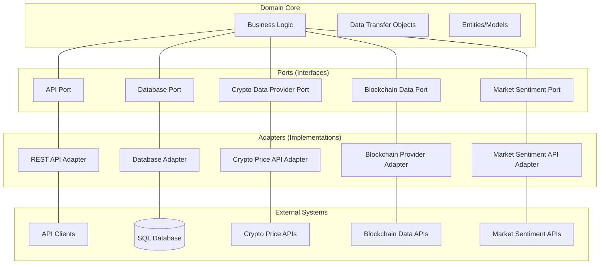

# Munki Backend

## Architecture Overview

### Core Domain
At the center lies our business logic and domain models - the heart of what makes our application valuable. This core remains isolated from external concerns like databases or APIs.

### Ports Layer
The middle layer defines interfaces (ports) that our core needs to interact with the outside world. These are contracts that specify what the core requires without dictating implementation details.

### Adapters Layer
The outer layer contains implementations (adapters) that fulfill the port contracts. These adapters translate between our core's needs and the specifics of external systems.

### Benefits
This architecture allows us to:
- Change external integrations without modifying core business logic
- Test business rules in isolation from external dependencies
- Develop and maintain components separately
- Easily swap implementations (e.g., switching from one crypto data provider to another)
- The arrows show how data flows through the system, with clear boundaries between components that make the system more resilient and adaptable.

### Graph

## Database Design
We identified major entities and how they relate to each other and other sub-entities

